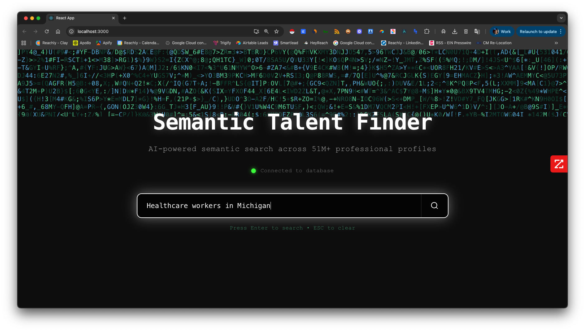

# 🔍 Semantic Talent Finder

**AI-Powered Professional Profile Search Engine**

[](https://openjdk.java.net/projects/jdk/21/)
[](https://spring.io/projects/spring-boot)
[](https://reactjs.org/)
[](https://www.postgresql.org/)



> **Search talent with natural language queries and export results to CSV.** Clean, professional data table interface for browsing and managing professional profiles.

## ✨ Key Features

- 🤖 **Natural Language Search**: Query using plain English ("healthcare workers in Michigan")
- 📊 **Clean Data Table**: Simple, pandas-like display with CSV export functionality
- 🔍 **14 Real Profiles**: Imported from actual LinkedIn data across multiple industries
- 🗂️ **CSV Export**: Export all profiles or selected profiles with one click
- 🏠 **Page Navigation**: Clean separation between home and results pages
- 🎯 **Accurate Results**: Search by location, industry, job title, or skills

## 🔍 Sample Searches

Try these queries to see the clean data table in action:
- **"texas"** → Returns 1 profile (Charlene Buchanon from Arlington, Texas)
- **"healthcare workers in Michigan"** → Returns Jessica Orchowski (Healthcare in Ann Arbor, Michigan)
- **"security"** → Returns security professionals across multiple states
- **"california"** → Returns 5+ profiles from California locations

## 🛠️ Tech Stack

**Backend:** Spring Boot 3.4.8 + Java 21 + PostgreSQL + pgvector  
**Frontend:** React 18 + TypeScript + TailwindCSS  
**Infrastructure:** Docker + Docker Compose  
**Data:** 14 real LinkedIn profiles with CSV export functionality

## 🚀 Quick Start

### **1. Start with Docker**
```bash
git clone https://github.com/your-username/semantic-talent-finder.git
cd semantic-talent-finder

# Set environment variable
export OPENAI_API_KEY=your_openai_api_key_here

# Start all services
docker-compose up -d
```

### **2. Access Application**
- **Frontend**: http://localhost:3000
- **Backend API**: http://localhost:8080

### **3. Test Searches**
- Search: **"texas"** → 1 result (Charlene Buchanon, Arlington, Texas)
- Search: **"healthcare workers in Michigan"** → 1 result (Jessica Orchowski, Ann Arbor, Michigan)
- Search: **"security"** → 2 results (security professionals)

## 📊 Data Table Features

- **Clean Display**: Simple, pandas-like table layout with no sorting complexity
- **CSV Export**: Download all results or selected profiles
- **Page Navigation**: Separate results page with "Back to Search" functionality
- **Real Data**: 14 actual LinkedIn profiles from various industries and locations

## 🏢 Profile Industries

The database contains profiles from:
- Healthcare & Medical Practice (Michigan, California)
- Security & Investigations (California, Washington DC)
- Automotive (Missouri)
- Construction & Building Materials (Texas, Pennsylvania)
- Technology & Cybersecurity (California)
- Banking & Financial Services (Colorado)
- Environmental Services (Oklahoma)
- Consumer Services & Tourism (Florida, California)

---

## 📄 License

This project is licensed under the MIT License.

**⭐ Star this repository if you found it helpful!**
